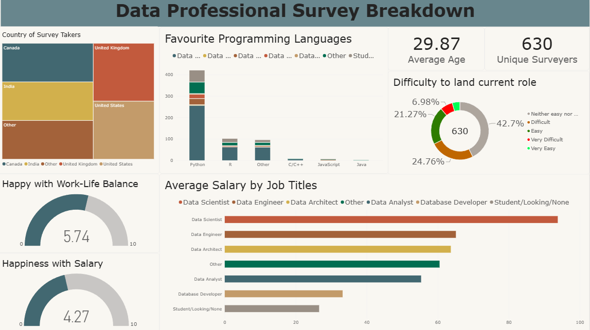

# Power BI Data Professional Survey Dashboard

## Project Overview

This project is an interactive Power BI dashboard based on a survey of data professionals.

The dashboard explores the backgrounds, roles, technical preferences, compensation, location, and job satisfaction of **630 survey respondents**.

The goal was to transform survey data into an easy-to-understand dashboard and identify patterns across different areas of the data professional career landscape.

## Tools Used

* **Microsoft Power BI** – Dashboard creation and data visualization
* **Power Query** – Data cleaning and transformation
* **DAX** – Calculated metrics and dashboard measures
* **Microsoft Excel** – Source data preparation

## Dashboard Highlights

The dashboard includes:

* **630 unique survey respondents**
* **Average age** of survey respondents
* **Average salary by job title**
* **Favourite programming languages**
* **Country of survey takers**
* **Happiness with salary**
* **Happiness with work-life balance**
* **Difficulty of landing the current role**

## 📈 Dashboard Preview



## Data Preparation

The source survey data was cleaned and transformed using Power Query before being used for visualization.

The preparation process included:

* Cleaning the source dataset
* Handling missing values
* Correcting data types
* Transforming columns for analysis
* Creating metrics required for the dashboard

## Key Findings

The dashboard provides a view of:

* The distribution of respondents across different data-related job titles
* Differences in average salary across job roles
* Programming language preferences among respondents
* The countries represented in the survey
* Respondents' reported satisfaction with salary and work-life balance
* How difficult respondents reported it was to land their current role

## Project Files

```text
├── README.md
├── Data Professional Survey Breakdown.pbix
├── data/
│   └── Power BI - Final Project.xlsx
└── screenshots/
    └── dashboard.png
```

Dataset Source: Alex The Analyst – Data Professional Survey. The dataset was provided for educational analysis as part of a Power BI tutorial. This project independently focuses on data cleaning, transformation, DAX measures, visualization, and dashboard design.
